# FCB Portfolio - Github

## Objectives

- Build the Skeleton of the Web Developer Portfolio
- Add Styling to the Portfolio
- Deploy the LIVE Web Developer Portfolio in Github Pages

#### Create Your Project in your Local Machine

1. Writing the `pwd` (present working directory) command in the Command Line should return a value of the location you are currently in. (Instructor to show his `pwd`). Our desired output should show that we are inside the `Documents` folder.
1. Inside your `Documents` folder, create a folder called `fcb-portfolio` by executing the command `mkdir fcb-portfolio`
1. Open your `Sublime Text` Application
1. Select on `File`
1. Select on `Open Folder`
1. Select the `fcb-portfolio` folder inside `Documents` and click Open Folder
1. `fcb-portfolio` folder showed now appear at the left side panel of the `Sublime Text` application
1. Right click on the `fcb-portfolio` and select new file
   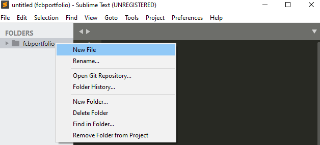
1. Type `index.html` in the newly opened tab and press save. A new file called index.html file should appear inside the fcbportfolio folder
   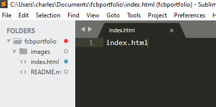
1. Right click on the fcb-portfolio folder again and create the `style.css` file and `images` folder.
   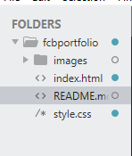

### Build the Skeleton of the Web Developer Portfolio

The `HTML` document is considered the building blocks/foundation of websites. All styling will be placed inside a separate stylesheet called a `CSS` file. We will use the text editor called `Sublime Text` to write our code.

- Double click on the `index.html` file.
- Go inside the `index.html` tab and change the value of the `<title>` to `"John Doe | Web Developer Portfolio"`

```html
<title>John Doe | Web Developer Portfolio</title>
```

- Right click anywhere inside the file and select open in browser. Show that the value inputted in the title is seen in the browser tab.
- The output that we see in our browser are the elements inside the `HTML` element called `<body>` tag. Erase everything inside the `<body>` tag. Save and refresh the browser to show that the page is blank.

* Inside `<body>`, create a `<div>` element with the `class="container"` that will serve as the wrapper of our whole layout.

```html
<!-- creates a wrapper/container for our layout -->
<div class="container"></div>
```

- inside the `<div>`, add 2 `<section>` elements. One with an `id` called `landing` and the other one `gallery`

```html
<!-- creates a wrapper/container for our layout -->
<div class="container">
	<section id="landing"></section>
	<!-- end landing -->

	<section id="gallery"></section>
	<!-- end gallery -->
</div>
```

- inside `#landing`, add an `<h1>` element with the full name of the `<dev>` element and an `<h2>` element with `Full Stack Web Developer` as its value. Save and check the output.

```html
<section id="landing">
	<h1>John Doe</h1>
	<h2>Full Stack Web Developer</h2>
</section>
```

- let's add a profile picture.
- Download an image of yourself and place it inside your `fcb-portfolio > images` folder.  
  As much as possible, make sure the that size of the `height` and `width` of the image are equal.  
  If not, at least the image is almost square in shape.

```html
<section id="landing">
	<h1>Full Stack Web Developer</h1>
	<p>Hi! My name is John and I love building things from scratch.</p>
	
</section>
```

- Inside `#gallery`, add two `<h2>` elements with `Languages I Speak` and `Tools I Use` as its content

```html
<section id="gallery">
	<h2>Languages I Speak</h2>
	<h2>Tools I Use</h2>
</section>
```

- Under `Languages I Speak`, create an unordered list and list the following items:

```html
<section id="gallery">
	<h2>Languages I Speak</h2>
	<ul>
		<li>HTML</li>
		<li>CSS</li>
	</ul>
	<h2>Tools I Use</h2>
</section>
```

- Under `Tools I Use`, create an unordered list and list the following items:

```html
<section id="gallery">
	<h2>Languages I Speak</h2>
	<ul>
		<li>HTML</li>
		<li>CSS</li>
	</ul>
	<h2>Tools I Use</h2>
	<ul>
		<li>Git Bash / Terminal</li>
		<li>Sublime Text</li>
		<li>Github</li>
		<li>Google Chrome</li>
	</ul>
</section>
```

- now let's add our styling

### Add Styling to the Portfolio

After creating the skeleton, we will now add styling to our webpage

#### Choose the font style/s that we will use

- Go to [Google Fonts](https://fonts.google.com)
- Select _Montserrat Semi-Bold 600_ and _Roboto Regular 400_
- Copy the link and place it inside `<head>...</head>` tags

```html
<!-- Google Fonts -->
<link rel="preconnect" href="https://fonts.gstatic.com" />
<link
	href="https://fonts.googleapis.com/css2?family=Montserrat:wght@600&family=Roboto&display=swap"
	rel="stylesheet"
/>
```

- Open up your `style.css` file, and remove everything inside it
- Let's declare a default font style.  
  The `*` universal selector selects all HTML elements.  
  Targetting it will enable us to declare a font style for all html elements.  
  Declaring a default font enables us to control how our text will look and not rely with what the browser gives us.

```css
* {
	font-family: "Roboto", sans-serif;
}
```

- Next, let's select our heading elements, `h1` and `h2` and declare Montserrat as the `font-family` for the said elements

```css
h1,
h2 {
	font-family: "Montserrat", sans-serif;
}
```

- Then, resize the image `height` and `width`.

```css
img {
	height: 250px;
	width: 250px;
}
```

#### Bootstrap

For clients and companies, time to market is as important as the tech stack you used to create a certain project.  
Bootstrap will enable us to develop mobile responsive layouts faster compared to using plain css.

- Go to https://getbootstrap.com/
- Go to `Docs` and select `v4.6.x` as this is currently the more stable version compared to Bootstrap 5.
- Scroll down to the starter template version and copy the required meta tags and link to the CSS library of Bootstrap
- Paste it inside the head element of your project

  - Paste the Bootstrap CSS link before the our own CSS file

  ```html
  <head>
  	<!-- Required meta tags -->
  	<meta charset="utf-8" />
  	<meta name="viewport" content="width=device-width, initial-scale=1" />
  	<meta name="generator" content="Github Pages" />
  	<title>John Doe | Web Developer Portfolio</title>

  	<!-- Google Fonts -->
  	<link rel="preconnect" href="https://fonts.gstatic.com" />
  	<link
  		href="https://fonts.googleapis.com/css2?family=Montserrat:wght@600&family=Roboto&display=swap"
  		rel="stylesheet"
  	/>

  	<!-- Bootstrap CSS -->
  	<link
  		rel="stylesheet"
  		href="https://cdn.jsdelivr.net/npm/bootstrap@4.5.3/dist/css/bootstrap.min.css"
  		integrity="sha384-TX8t27EcRE3e/ihU7zmQxVncDAy5uIKz4rEkgIXeMed4M0jlfIDPvg6uqKI2xXr2"
  		crossorigin="anonymous"
  	/>

  	<!-- external css -->
  	<link rel="stylesheet" href="style.css" />
  </head>
  ```

- Copy the Bootstrap script dependencies and place it before the closing body tag

```html
	<!-- Option 1: jQuery and Bootstrap Bundle (includes Popper) -->
    <script src="https://code.jquery.com/jquery-3.5.1.slim.min.js" integrity="sha384-DfXdz2htPH0lsSSs5nCTpuj/zy4C+OGpamoFVy38MVBnE+IbbVYUew+OrCXaRkfj" crossorigin="anonymous"></script>
    <script src="https://cdn.jsdelivr.net/npm/bootstrap@4.5.3/dist/js/bootstrap.bundle.min.js" integrity="sha384-ho+j7jyWK8fNQe+A12Hb8AhRq26LrZ/JpcUGGOn+Y7RsweNrtN/tE3MoK7ZeZDyx" crossorigin="anonymous"></script>

	</body>
```

- Did you notice the space that was generated after linking the Bootstrap dependencies?  
  This is because of the class container that we used for our div element.  
  By default, Bootstrap has 2 types of wrappers/containers that we can use so we can control the layout of our webpage.  
  Class `container` sets a `max-width`, hence the space at the sides.  
  Class `container-fluid` creates a fluid layout which will make our layout span the whole width of the screen.  
  Let's change the class `container` to `container-fluid` to achieve the fluid layout.

```html
<!-- creates a wrapper/container for our layout -->
<div class="container-fluid">
	<!-- ... -->
</div>
```

- Next step is to create a mobile responsive navbar. Before the `container-fluid` element and let's add a navbar.
- Go to the components page and click on navbar. copy the first example and paste in your HTML file.
- Save and refresh the page.
- After refreshing, let's clean up the navbar
- Change `navbar-light` to `navbar-dark` so the text will be a light color instead of a dark one.
- Change `bg-light` to `bg-primary` to change the background color of the navbar to blue.
- Remove the `<a>` element with `navbar-brand`
- Change `mr-auto` to `mx-auto` to center the list of nav items to the right most of the navbar  
  `m` means margin  
  `x` means the x-axis (left and right)  
  `auto` means the browser automatically calculate the size of the margins
- Delete the `<li>` items inside the unordered list, and let's create our own.
- When a user clicks on `Home`, user will be redirected to the element with the ID, `landing`.
- When a user clicks on `Gallery`, user will be redirected to the element with the ID, `gallery`.
- Show the effect when on mobile.

```html
<nav class="navbar navbar-expand-lg navbar-dark bg-primary">
	<button
		class="navbar-toggler"
		type="button"
		data-toggle="collapse"
		data-target="#portfolio-nav"
	>
		<span class="navbar-toggler-icon"></span>
	</button>

	<div class="collapse navbar-collapse" id="portfolio-nav">
		<ul class="navbar-nav mx-auto">
			<li class="nav-item">
				<a href="#landing" class="nav-link"> Home </a>
			</li>
			<li class="nav-item">
				<a href="#gallery" class="nav-link"> Gallery </a>
			</li>
		</ul>
	</div>
</nav>
```

#### Adding Bootstrap styling to our Page

- Add the class jumbotron to `#landing`. This will enable us to use Bootstrap's jumbotron component which is perfect for landing pages/sections.

```html
<section class="jumbotron" id="landing">
	<h1>Full Stack Web Developer</h1>
	<p>Hi! My name is John and I love building things from scratch.</p>
	
</section>
<!-- /#landing -->
```

- Add the class `text-center` which centers the text horizontally
- Add the class `img-fluid` to the image to avoid the image from overflowing
- Add the class `mt-3` to add a top margin to our element

```html
<section class="jumbotron text-center mt-3" id="landing">
	<h1>Full Stack Web Developer</h1>
	<p>Hi! My name is John and I love building things from scratch.</p>
	
</section>
<!-- /#landing -->
```

- For `#gallery`, add the class `text-center` to center the text horizontally

```html
<section id="gallery" class="text-center">
	<h2>Languages I Speak</h2>
	<ul>
		<li>HTML</li>
		<li>CSS</li>
	</ul>
	<h2>Tools I Use</h2>
	<ul>
		<li>Terminal</li>
		<li>Gitbash</li>
		<li>Sublime Text</li>
		<li>Github</li>
	</ul>
</section>
<!-- /#gallery -->
```

#### Add styling via external CSS

- Center the elements inside landing using `flexbox`

```css
#landing {
	height: 80vh;
	/* center the content vertically using flexbox */
	display: flex;
	flex-direction: column;
	justify-content: center;
	align-items: center;
}
```

- Optional: if we want to remove the background color of `.jumbotron`

```css
.jumbotron {
	background-color: transparent;
}
```

- Target the lists inside `#gallery` and center the content vertically using `flexbox`

```css
#gallery {
	/* center the content vertically using flexbox */
	display: flex;
	align-items: center;
	flex-direction: column;
	justify-content: center;
}
```

- Resize the height of `#gallery` to show vertical alignment of content did change

```css
#gallery {
	/* ... */
	height: 75vh;
}
```

- Remove all `padding`s and bullets of list items

```css
ul {
	list-style: none;
	padding: 0;
}
```

- Change the color of the section headers

```css
h2 {
	color: #007bff;
}
```

- Create 2 `<div>` tags as containers in `#gallery` with `.tools` class

```html
<section id="gallery" class="text-center">
	<div class="tools">
		<h2>Languages I Speak</h2>
		<!-- ... -->
	</div>
	<div class="tools">
		<h2>Tools I Use</h2>
		<!-- ... -->
	</div>
</section>
<!-- /.gallery -->
```

- Create the following CSS rules for `.tools` and elaborate briefly

```css
.tools {
	padding: 25px;
	height: 200px;
	border: 5px solid #f2f2f2;
	margin: 20px;
	width: 75%;
}
```

- Add `bg-dark` class to `#gallery` section

```html
<section id="gallery" class="text-center bg-dark">
	<!-- ... -->
</section>
```

- Set `.tools` elements' font color to `white`

```css
.tools {
	/* ... */
	color: white;
}
```

- Change `border-radius` of `#gallery`

```css
#gallery {
	/* ... */
	border-radius: 6px;
}
```

- Remove this line

```html
<a class="navbar-brand" href="#">Navbar</a>
```

- Make the navbar stay at the top by using `fixed-top` class

```html
<nav class="navbar navbar-expand-lg navbar-dark bg-primary fixed-top"></nav>
```

- Make scrolling the page smooth

```css
html {
	scroll-behavior: smooth;
}
```

### Deploy the LIVE Web Developer Portfolio in Github Pages

In your machines, go to your Documents folder and right click on it

- For Windows users, select `Git Bash` Here from the options
- For Mac users, select `Open Terminal Here` or drag the `Documents` folder to the `Terminal` icon in the Dock
- For Linux users, select `Open Terminal`

- Reminders:
  - Pressing the up arrow key inside the CLI will return the last command you executed
  - While inputting your password, no keys will appear but you are actually already typing your password

1. Writing the `pwd` (present working directory) command in the Command Line should return a value of the location you are currently in. (Instructor to show his `pwd`). Our desired output should show that we are inside the `Documents` folder.
1. Inside your `Documents` folder, go inside your project folder called `fcb-portfolio` by executing the command `cd fcb-portfolio`

#### Create a new `git` commit

- Inside the fcbportfolio folder, run the git init command. This will initialize Git to our project folder.

```bash
 $ git init
```

- Check the status of project's working directory.
  ```bash
  $ git status
  ```
- Add all existing changes to the staging area.
  ```bash
  $ git add -A
  ```
- Commit all changes from the staging area.
  ```bash
  $ git commit -m "<describe the changes>"
  ```

#### Add a remote repository

- Do not close your Terminal. Go to Github(https://www.github.com) and Login using your registered email.
  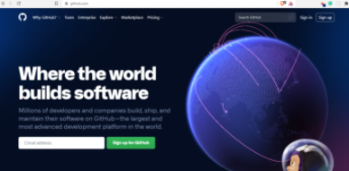

- Once logged in, click on the `New Repository` button or the `Start a Project` button
  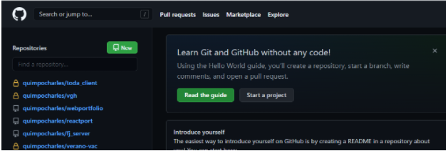

- Name your remote project/repository as `fcbportfolio`. Leave the Permission to `Public` and click on Create Repository.
  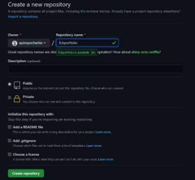

- Copy the `HTTPS URL` of your new project
  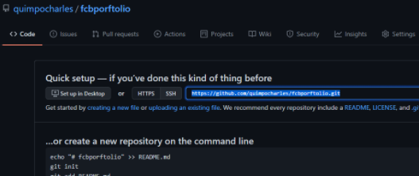

- Go back to the Terminal and run the command `git remote add github <paste the HTTPS URL from your Github repository>`
  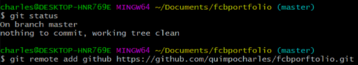

#### Push all commits to a remote `git` repository

- Check connected remote `git` repositories.
  ```bash
  $ git remote -v
  ```
- Push to target remote `git` repository.

  ````bash
  	$ git push <remote> <branch>
  	$ git push github master
  	```
  **NOTE:**
  ````

- Enable GitHub Pages of our project.  
  `fcb-portfolio > Settings > Pages > Source`  
  Set branch from `None` to `master` and the destination folder should be `root`. Click `Save`.  
  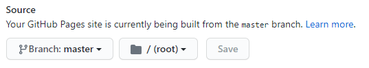  
  Doing this will deploy the project and will create a new link.  
  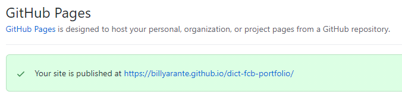

### As of August 13, 2021, Github has removed simple username/password authentication. 

[Github Blog](https://github.blog/changelog/2021-08-12-git-password-authentication-is-shutting-down/)

## Instead, we have to create a personal access token:

	Go to your github profile and select settings.

	Then, in your settings, scroll down to the left pane and select developer settings.

	Then, in developer settings, select Personal Access Tokens.

	Then, add your note and expiration date:

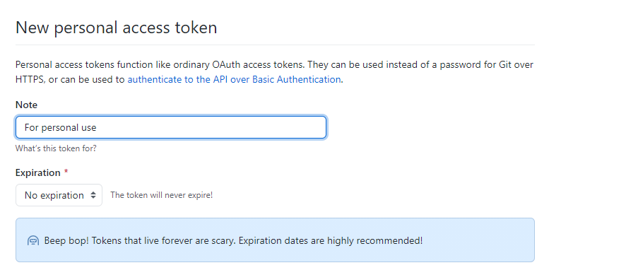

	Then, generate new token with the following scopes checked:

		repo 
		repo:status 
		repo_deployment 
		public_repo 
		repo:invite 
		security_events 
		read:repo_hook 
		delete_repo

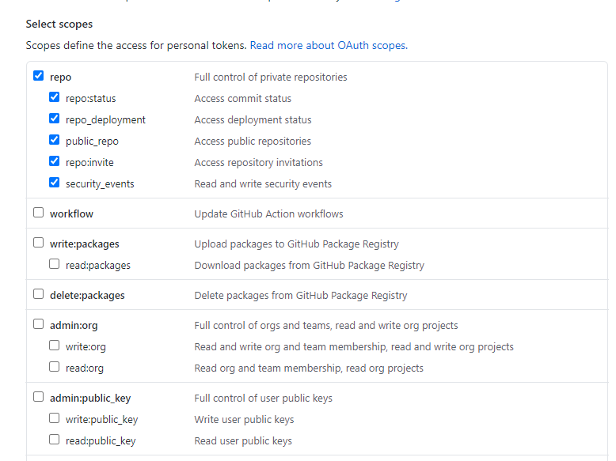
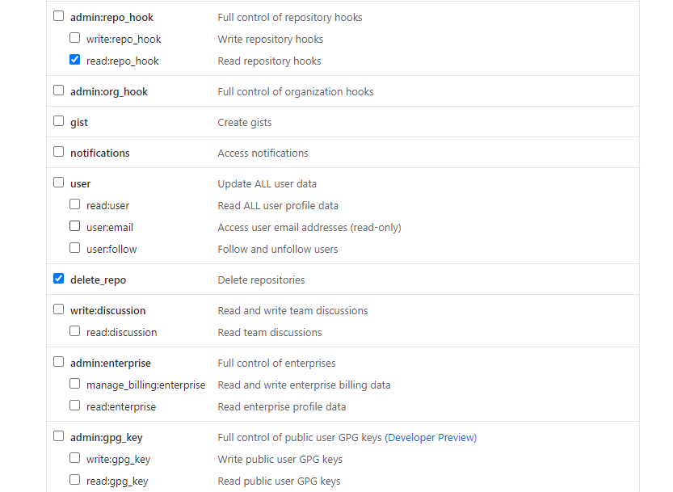

	Then, generate your token and use the token as the password instead.

#### The End
